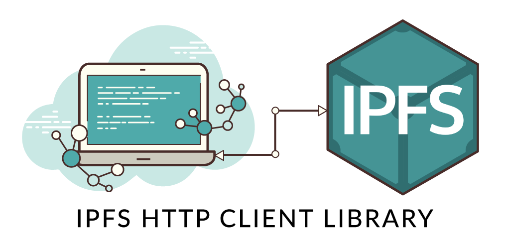

# ontology-ddxf-bot

English | [中文](README_CN.md)

<!-- TOC -->

- [1. Elliptic Curve Integrated Encryption Scheme (ECIES)](#1-elliptic-curve-integrated-encryption-scheme-ecies)
- [2. Ontology Distributed Identity Framework (ONT ID)](#2-ontology-distributed-identity-framework-ont-id)
- [3. InterPlanetary File System (IPFS)](#3-interplanetary-file-system-ipfs)
    - [3.1. How IPFS Works](#31-how-ipfs-works)
    - [3.2. IPFS HTTP API](#32-ipfs-http-api)
    - [3.3. Initialize your IPFS Repository](#33-initialize-your-ipfs-repository)
    - [3.4. Create your Private IPFS Network (optional)](#34-create-your-private-ipfs-network-optional)
    - [3.5. Run your IPFS Node](#35-run-your-ipfs-node)
    - [3.6. Client Library for IPFS API](#36-client-library-for-ipfs-api)
- [4. Bancor Protocol](#4-bancor-protocol)
    - [4.1. Introduction](#41-introduction)
    - [4.2. A New Method for Price Discovery](#42-a-new-method-for-price-discovery)
- [5. Atomic Swaps](#5-atomic-swaps)
    - [5.1. Introduction](#51-introduction)
    - [5.2. Atomic Swaps between Encrypted IPFS Address and DToken](#52-atomic-swaps-between-encrypted-ipfs-address-and-dtoken)

<!-- /TOC -->

## 1. Elliptic Curve Integrated Encryption Scheme (ECIES)

Elliptic Curve Integrated Encryption Scheme(also ECIES), is a hybrid encryption system proposed by Victor Shoup in 2001. Shoup's submission can be found at [here](https://www.shoup.net/papers/iso-2_1.pdf).

## 2. Ontology Distributed Identity Framework (ONT ID)

Ontology DID (also called ONT ID) is a decentralized identity identification protocol based on W3C DID specifications. ONT ID establishes a cryptographically-based digital identity for each entity, allowing self-sovereign of data authorization and ownership confirmation, which makes the identity and data truly assets that the user can control.

If you are interested in ONT ID, you can find a detailed introduction [here](https://ontio.github.io/documentation/ontology_DID_en.html).

<div align=center></div>

## 3. InterPlanetary File System (IPFS)

InterPlanetary File System (IPFS) is a protocol and network designed to create a content-addressable, peer-to-peer method of storing and sharing hypermedia in a distributed file system.

<div align=center></div>

### 3.1. How IPFS Works

You may be interested about how IPFS works. In fact, when we add files to IPFS:

- Each file and all of the blocks within it are given a unique fingerprint called a cryptographic hash.
- IPFS removes duplications across the network.
- Each network node stores only content it is interested in, and some indexing information that helps figure out who is storing what.
- When looking up files, you're asking the network to find nodes storing the content behind a unique hash.
- Every file can be found by human-readable names using a decentralized naming system called IPNS.

### 3.2. IPFS HTTP API

When an IPFS node is running as a daemon, it exposes an HTTP API that allows you to control the node and run the same commands you can from the command line.

In many cases, using this API this is preferable to embedding IPFS directly in your program — it allows you to maintain peer connections that are longer lived than your app and you can keep a single IPFS node running instead of several if your app can be launched multiple times. In fact, the ipfs CLI commands use this API when operating in online mode.

This API is intended to be the same across different IPFS implementations. However, not all implementations are equally up-to-date. The most feature-complete (and the current reference for this specification) is go-ipfs.

<div align=center></div>

### 3.3. Initialize your IPFS Repository

IPFS stores all its settings and internal data in a directory called the repository. Before using IPFS for the first time, you’ll need to initialize the repository with the ipfs init command:

```shell
PS C:\Users> ipfs init
initializing IPFS node at C:\Users\.ipfs
generating 2048-bit RSA keypair...done
peer identity: QmbhtBLaPLLUXgon7Quue1JkLjRmoQmm97cqto9JdJ4KuR
to get started, enter:

        ipfs cat /ipfs/QmS4ustL54uo8FzR9455qaxZwuMiUhyvMcX9Ba8nUH4uVv/readme
```

The hash after `peer identity` is your node’s ID and will be different from the one shown in the above output. Other nodes on the network use it to find and connect to you. You can run ipfs id at any time to get it again if you need it.

### 3.4. Create your Private IPFS Network (optional)

The IPFS bootstrap list is a list of peers with which the IPFS daemon learns about other peers on the network. IPFS comes with a default list of trusted peers, but you are free to modify the list to suit your needs. One popular use for a custom bootstrap list is to create a personal IPFS network. You can get you IPFS bootstrap list by `bootstrap` command.

```shell
PS C:\Users> ipfs bootstrap
/dnsaddr/bootstrap.libp2p.io/ipfs/QmNnooDu7bfjPFoTZYxMNLWUQJyrVwtbZg5gBMjTezGAJN
/dnsaddr/bootstrap.libp2p.io/ipfs/QmQCU2EcMqAqQPR2i9bChDtGNJchTbq5TbXJJ16u19uLTa
/dnsaddr/bootstrap.libp2p.io/ipfs/QmbLHAnMoJPWSCR5Zhtx6BHJX9KiKNN6tpvbUcqanj75Nb
/dnsaddr/bootstrap.libp2p.io/ipfs/QmcZf59bWwK5XFi76CZX8cbJ4BhTzzA3gU1ZjYZcYW3dwt
/ip4/104.131.131.82/tcp/4001/ipfs/QmaCpDMGvV2BGHeYERUEnRQAwe3N8SzbUtfsmvsqQLuvuJ
/ip4/104.236.179.241/tcp/4001/ipfs/QmSoLPppuBtQSGwKDZT2M73ULpjvfd3aZ6ha4oFGL1KrGM
/ip4/104.236.76.40/tcp/4001/ipfs/QmSoLV4Bbm51jM9C4gDYZQ9Cy3U6aXMJDAbzgu2fzaDs64
/ip4/128.199.219.111/tcp/4001/ipfs/QmSoLSafTMBsPKadTEgaXctDQVcqN88CNLHXMkTNwMKPnu
/ip4/178.62.158.247/tcp/4001/ipfs/QmSoLer265NRgSp2LA3dPaeykiS1J6DifTC88f5uVQKNAd
/ip6/2400:6180:0:d0::151:6001/tcp/4001/ipfs/QmSoLSafTMBsPKadTEgaXctDQVcqN88CNLHXMkTNwMKPnu
/ip6/2604:a880:1:20::203:d001/tcp/4001/ipfs/QmSoLPppuBtQSGwKDZT2M73ULpjvfd3aZ6ha4oFGL1KrGM
/ip6/2604:a880:800:10::4a:5001/tcp/4001/ipfs/QmSoLV4Bbm51jM9C4gDYZQ9Cy3U6aXMJDAbzgu2fzaDs64
/ip6/2a03:b0c0:0:1010::23:1001/tcp/4001/ipfs/QmSoLer265NRgSp2LA3dPaeykiS1J6DifTC88f5uVQKNAd
```

**Note**: You **must** understand the risks of adding or removing nodes form IPFS node's bootstrap list, before you do it.

Therefore, If you want to create your own IPFS network, you need to remove the default list of trusted peers, and add the peers that you trusted.

```shell
PS C:\Users> ipfs bootstrap rm --all
removed /dnsaddr/bootstrap.libp2p.io/ipfs/QmNnooDu7bfjPFoTZYxMNLWUQJyrVwtbZg5gBMjTezGAJN
removed /dnsaddr/bootstrap.libp2p.io/ipfs/QmQCU2EcMqAqQPR2i9bChDtGNJchTbq5TbXJJ16u19uLTa
removed /dnsaddr/bootstrap.libp2p.io/ipfs/QmbLHAnMoJPWSCR5Zhtx6BHJX9KiKNN6tpvbUcqanj75Nb
removed /dnsaddr/bootstrap.libp2p.io/ipfs/QmcZf59bWwK5XFi76CZX8cbJ4BhTzzA3gU1ZjYZcYW3dwt
removed /ip4/104.131.131.82/tcp/4001/ipfs/QmaCpDMGvV2BGHeYERUEnRQAwe3N8SzbUtfsmvsqQLuvuJ
removed /ip4/104.236.179.241/tcp/4001/ipfs/QmSoLPppuBtQSGwKDZT2M73ULpjvfd3aZ6ha4oFGL1KrGM
removed /ip4/104.236.76.40/tcp/4001/ipfs/QmSoLV4Bbm51jM9C4gDYZQ9Cy3U6aXMJDAbzgu2fzaDs64
removed /ip4/128.199.219.111/tcp/4001/ipfs/QmSoLSafTMBsPKadTEgaXctDQVcqN88CNLHXMkTNwMKPnu
removed /ip4/178.62.158.247/tcp/4001/ipfs/QmSoLer265NRgSp2LA3dPaeykiS1J6DifTC88f5uVQKNAd
removed /ip6/2400:6180:0:d0::151:6001/tcp/4001/ipfs/QmSoLSafTMBsPKadTEgaXctDQVcqN88CNLHXMkTNwMKPnu
removed /ip6/2604:a880:1:20::203:d001/tcp/4001/ipfs/QmSoLPppuBtQSGwKDZT2M73ULpjvfd3aZ6ha4oFGL1KrGM
removed /ip6/2604:a880:800:10::4a:5001/tcp/4001/ipfs/QmSoLV4Bbm51jM9C4gDYZQ9Cy3U6aXMJDAbzgu2fzaDs64
removed /ip6/2a03:b0c0:0:1010::23:1001/tcp/4001/ipfs/QmSoLer265NRgSp2LA3dPaeykiS1J6DifTC88f5uVQKNAd
```

**Tips**: With an empty list, we can restore the default bootstrap list by `--default` option.

```shell
ipfs bootstrap add --default
```

To be extra cautious, You can also set the `LIBP2P_FORCE_PNET` environment variable to 1 to force the usage of private networks. If no private network is configured, the daemon will fail to start.

```shell
user@ubuntu:~$ export LIBP2P_FORCE_PNET=1
user@ubuntu:~$ echo $LIBP2P_FORCE_PNET
1
```

To create a private network, we also need to create a `swarm.key` file to enable private network feature of IPFS. We will start by adding a key called the `swarm.key` that tells the IPFS nodes that they will be a part of a private network which all will share this `swarm.key` file.

If you have Go environment, you can run the following command to install the `swarm.key` generation utility:

```shell
go get -u github.com/Kubuxu/go-ipfs-swarm-key-gen/ipfs-swarm-key-gen
```

After install this utility successful, you can run it in one of your node like this:

```shell
ipfs-swarm-key-gen > ~/.ipfs/swarm.key
```

Then, you need to copy the file generated to the IPFS directory of each node.

Now, you can add your new bootstrap node to build your private network. For example:

```shell
PS C:\Users> ipfs bootstrap add /ip4/192.168.181.141/tcp/4001/ipfs/QmYzdL2Pe3JvoqMZ1qvcVMnAWo4fVqyvw2S8XDnxHLK8MV
added /ip4/192.168.181.141/tcp/4001/ipfs/QmYzdL2Pe3JvoqMZ1qvcVMnAWo4fVqyvw2S8XDnxHLK8MV
```

### 3.5. Run your IPFS Node

Before we use IPFS HTTP API, we need to run our IPFS node as a daemon.

```shell
PS C:\Users> ipfs daemon
```

If your node run properly, you can see the following output.

```shell
Initializing daemon...
Swarm is limited to private network of peers with the swarm key
Swarm key fingerprint: e06fa4c6c256f4524bc3abb4a1515556
Swarm listening on /ip4/127.0.0.1/tcp/4001
Swarm listening on /ip4/169.254.120.205/tcp/4001
Swarm listening on /ip4/169.254.28.251/tcp/4001
Swarm listening on /ip4/169.254.77.95/tcp/4001
Swarm listening on /ip4/192.168.182.1/tcp/4001
Swarm listening on /ip4/192.168.50.211/tcp/4001
Swarm listening on /ip4/192.168.56.1/tcp/4001
Swarm listening on /ip4/192.168.99.1/tcp/4001
Swarm listening on /ip6/::1/tcp/4001
Swarm listening on /p2p-circuit/ipfs/QmauvPUxzGN32aBtHXGRGCbNPxkpCA5ZFc637ABFjGe2mF
Swarm announcing /ip4/127.0.0.1/tcp/4001
Swarm announcing /ip4/169.254.120.205/tcp/4001
Swarm announcing /ip4/169.254.28.251/tcp/4001
Swarm announcing /ip4/169.254.77.95/tcp/4001
Swarm announcing /ip4/192.168.182.1/tcp/4001
Swarm announcing /ip4/192.168.3.90/tcp/49660
Swarm announcing /ip4/192.168.50.211/tcp/4001
Swarm announcing /ip4/192.168.56.1/tcp/4001
Swarm announcing /ip4/192.168.99.1/tcp/4001
Swarm announcing /ip6/::1/tcp/4001
API server listening on /ip4/127.0.0.1/tcp/5001
Gateway (readonly) server listening on /ip4/127.0.0.1/tcp/8080
Daemon is ready
```

### 3.6. Client Library for IPFS API

- [Go](https://github.com/ipfs/go-ipfs-api)
- [Python](https://github.com/ipfs/py-ipfs-api)
- [JavaScript](https://github.com/ipfs/js-ipfs)

## 4. Bancor Protocol

### 4.1. Introduction

Currencies, which are essentially networks of value , do not connect to each other in the same way that information networks do. While the switches on Internet exchange points (IXs) interlink information networks, active traders on exchanges are effectively interlinking currencies.

The current exchange model for currencies/assets has a critical barrier, requiring a certain volume of trading activity to achieve market-liquidity. This inherent barrier makes it nearly impossible for small-scale currencies (such as community currencies, loyalty points or other custom tokens) to be linked (exchangeable) to other popular currencies using a market-determined exchange rate.

The Bancor protocol enables built-in price discovery and a liquidity mechanism for tokens on smart contract blockchains. These “smart tokens” hold one or more other tokens in reserve, and enable any party to instantly purchase or liquidate the smart token in exchange for one of its reserve tokens, directly through the smart token’s contract, at a continuously calculated price, according to a formula which balances buy and sell volumes.

The Bancor protocol is named in honor of the Keynesian proposal to introduce a supranational reserve currency called Bancor to systematize international currency conversion after WWII.

### 4.2. A New Method for Price Discovery

The CRR is set by the smart token creator, for each ONG, and used in price calculation, along with the Data Token’s (short for DToken) current supply and reserve balance, in the following way:

<div align=center><a href="https://www.codecogs.com/eqnedit.php?latex=Price&space;=&space;\frac{Balance}{Supply&space;\times&space;CRR}" target="_blank"></a></div>

This calculation ensures that a constant ratio is kept between the ONG balance and the DToken’s market cap, which is its supply times its price. When DToken are purchased (in any of their reserve currencies) the payment for the purchase is added to the reserve balance, and based on the calculated price, new smart tokens
are issued to the buyer. Due to the calculation above, a purchase of a smart token with a less than 100% CRR will cause its price to increase, since both the reserve balance and the supply are increasing, while the latter is multiplied by a fraction.

## 5. Atomic Swaps

### 5.1. Introduction

Atomic swap is a smart contract technology that enables exchange of one cryptocurrency for another without using centralized intermediaries, such as exchanges.

Atomic swaps can take place directly between blockchains of different cryptocurrencies or they can be conducted off-chain, away from the main blockchain. They first came into prominence in September 2017, when an atomic swap between Decred and Litecoin was [conducted](https://twitter.com/decredproject/status/910224860625780736).

Since then, other startups and decentralized exchanges have allowed users the same facility. For example, Lightning Labs, a startup that uses bitcoin’s lightning network for transactions, has conducted off-chain swaps using the technology.

### 5.2. Atomic Swaps between Encrypted IPFS Address and DToken

