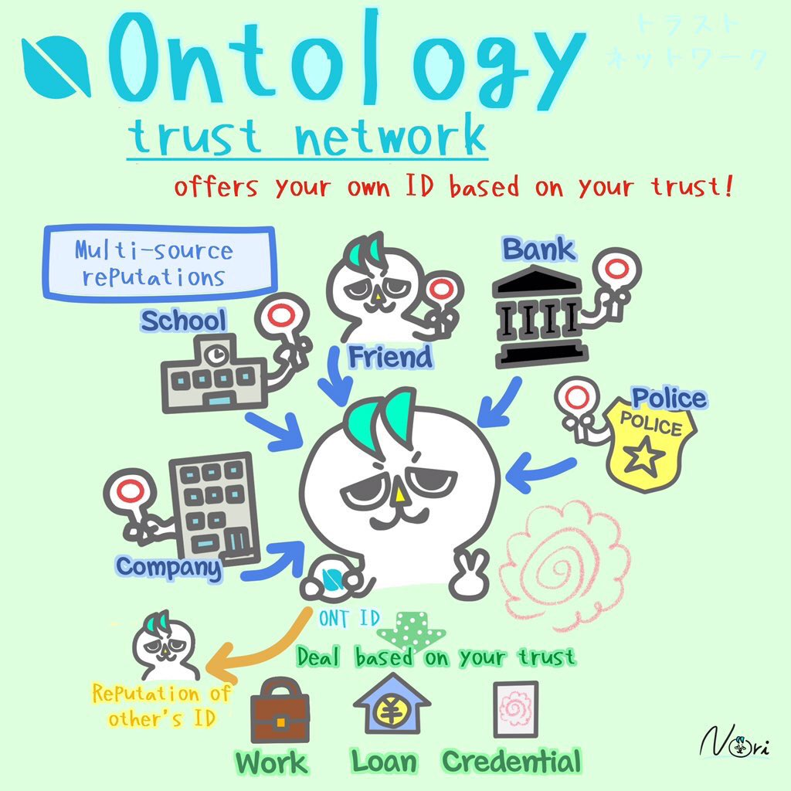

# 去中心化数据交换机器人

[English](README.md) | 中文

<!-- TOC -->

- [1. 基于椭圆曲线的整合加密方案（ECIES）](#1-基于椭圆曲线的整合加密方案ecies)
- [2. 本体分布式身份框架 （ONT ID）](#2-本体分布式身份框架-ont-id)
- [3. 星际文件系统 （IPFS）](#3-星际文件系统-ipfs)
    - [3.1. 星际文件系统是如何工作的？](#31-星际文件系统是如何工作的)
- [4. 星际文件系统 HTTP API](#4-星际文件系统-http-api)

<!-- /TOC -->

## 1. 基于椭圆曲线的整合加密方案（ECIES）

基于椭圆曲线的整合加密方案是一种由 Victor Shoup 在2001年提出的混合加密体系。Shoup 的提案可以在[这里](https://www.shoup.net/papers/iso-2_1.pdf)找到。

## 2. 本体分布式身份框架 （ONT ID）

本体身份数字身份标识（简称为 ONT ID）是一个建立在 W3C 数字身份标识规范基础之上的分布式身份标识协议。ONT ID 为每个实体建立了一个以密码学为基础的数字身份，实现了数据授权的自主性以及所有权的确认，这使得身份和数据成为了用户真正可以控制的资产。

如果你对 ONT ID 感兴趣，你可以在[这里](https://ontio.github.io/documentation/ontology_DID_zh.html)找到更多的信息。

## 3. 星际文件系统 （IPFS）

行星际文件系统（IPFS）是一种基于内容寻址的协议和一个点对点网络，旨在提供一种在分布式文件系统中存储和共享超媒体的方法。

### 3.1. 星际文件系统是如何工作的？

你也许会对星际文件系统的工作方式感兴趣。实际上，当我们向IPFS添加文件时：

- 每个文件及其中的所有块都被赋予了一个称为加密哈希的唯一指纹。
- IPFS消除了网络上的重复。
- 每个网络节点仅存储它感兴趣的内容，以及一些索引信息，帮助确定谁在存储什么。
- 查找文件时，你通过一个唯一的哈希值去请求网络查找内容存储节点。
- 使用名为IPNS的去中心化命名系统，可通过人类可读的名称找到每个文件。

## 4. 星际文件系统 HTTP API

当星际文件系统节点作为守护程序运行时，它会公开一个HTTP API，允许你控制节点并在命令行运行相同的命令。

在许多情况下，使用此API比在程序中直接嵌入星际文件系统更好——它允许你维护比你的应用程序更长的对等连接，并且如果你的应用程序会启动多次，你可以保持单个IPFS节点运行而不是多次。 实际上，IPFS CLI命令在联机模式下运行时会使用此API。

星际文件系统 HTTP API旨在使不同的星际文件系统实现保持相同的 HTTP API。但是，并非所有实现都同样是最新的，功能最完整（以及此规范的当前参考）是 go-ipfs。